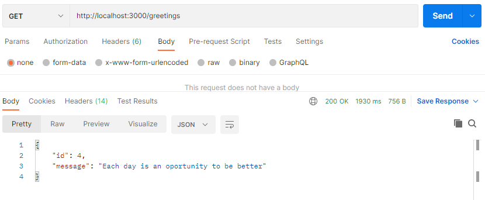

# Rails Quotes API
> This API will return a random quote from the database.
> There is a [FrontEnd version](https://github.com/RafaelEchart/React_QuotesAPI) to use this API

## Getting Started

To get a local copy up and running follow these simple example steps.

### Prerequisites

- Ruby
- Ruby on Rails 
- PostgreSQL
- Terminal

### Setup

git clone https://github.com/RafaelEchart/Rails_QuotesAPI.git

### Install

Run in the terminal to install the gems:

`bundle install`

`rails db:migrate db:seed`

### Usage

To run the Rails server, in the terminal: 

`rails s`

## Author

👤 **Rafael Echart**

- GitHub: [@RafaelEchart](https://github.com/rafaelechart)
- Twitter: [@RafaelEchart](https://twitter.com/rafaelechart)

## 🤝 Contributing

Contributions, issues, and feature requests are welcome!

## Show your support

Give a ⭐️ if you like this project!

## Acknowledgments

- Ruby and Ruby on Rails Documentation
- Microverse Guidelines
- Rafael Echart

## 📝 License

This project is [MIT](./MIT.md) licensed.
